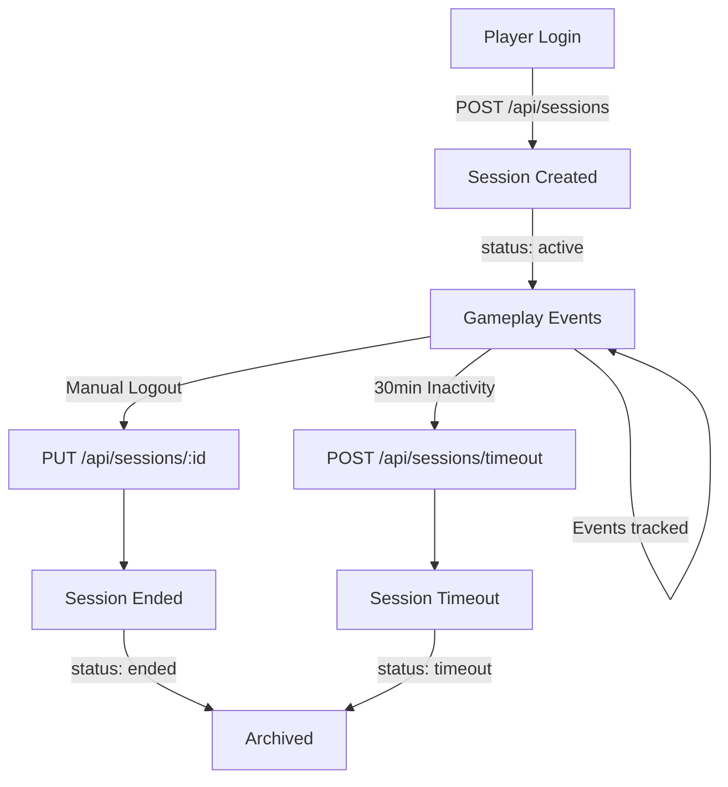

# Session Management API Documentation

**Epic 2 - Game Session Tracking**
**GitHub Issue:** #5

## Overview

The Session Management API provides comprehensive session tracking for the AI-Native Game World Demo. It enables session lifecycle management, player analytics, and event correlation.

## Table of Contents

1. [Quick Start](#quick-start)
2. [Session Lifecycle](#session-lifecycle)
3. [API Endpoints](#api-endpoints)
4. [Data Models](#data-models)
5. [Examples](#examples)
6. [Best Practices](#best-practices)

---

## Quick Start

### Typical Session Flow

```javascript
// 1. Player logs in - create session
const loginResponse = await fetch('/api/sessions', {
  method: 'POST',
  headers: { 'Content-Type': 'application/json' },
  body: JSON.stringify({ playerId: 'player-uuid' })
});
const { session } = await loginResponse.json();

// 2. Player performs actions - create events with session
await fetch('/api/event/create-with-session', {
  method: 'POST',
  headers: { 'Content-Type': 'application/json' },
  body: JSON.stringify({
    playerId: 'player-uuid',
    sessionId: session.id,  // Optional - auto-populated if omitted
    eventType: 'wolf_kill',
    location: 'Northern Forest'
  })
});

// 3. Player logs out - end session
await fetch(`/api/sessions/${session.id}`, {
  method: 'PUT',
  headers: { 'Content-Type': 'application/json' },
  body: JSON.stringify({ reason: 'ended' })
});
```

---

## Session Lifecycle



### Session States

| Status | Description | Can Transition To |
|--------|-------------|-------------------|
| `active` | Player is currently logged in and playing | `ended`, `timeout` |
| `ended` | Player explicitly logged out | None (terminal state) |
| `timeout` | Session timed out due to inactivity | None (terminal state) |

---

## API Endpoints

### 1. Create Session

**POST** `/api/sessions`

Create a new game session for a player.

#### Request Body

```json
{
  "playerId": "550e8400-e29b-41d4-a716-446655440000",
  "metadata": {
    "loginMethod": "oauth",
    "device": "mobile",
    "ip": "192.168.1.1"
  }
}
```

| Field | Type | Required | Description |
|-------|------|----------|-------------|
| `playerId` | string (UUID) | Yes | Player's unique identifier |
| `metadata` | object | No | Optional session metadata |

#### Success Response (201 Created)

```json
{
  "success": true,
  "session": {
    "id": "a50e8400-e29b-41d4-a716-446655440010",
    "playerId": "550e8400-e29b-41d4-a716-446655440000",
    "startedAt": "2024-03-12T10:00:00Z",
    "endedAt": null,
    "status": "active",
    "metadata": {
      "loginMethod": "oauth",
      "device": "mobile"
    }
  },
  "message": "Session created successfully"
}
```

#### Error Response (409 Conflict)

```json
{
  "success": false,
  "error": "Player already has an active session",
  "details": "Player 550e8400... already has an active session: a50e8400..."
}
```

---

### 2. List Sessions

**GET** `/api/sessions`

Retrieve sessions with optional filtering.

#### Query Parameters

| Parameter | Type | Default | Description |
|-----------|------|---------|-------------|
| `playerId` | string | - | Filter sessions by player ID |
| `includeEnded` | boolean | true | Include ended sessions |
| `stats` | boolean | false | Include player statistics |

#### Examples

```bash
# Get all sessions for a player
GET /api/sessions?playerId=550e8400-e29b-41d4-a716-446655440000

# Get only active sessions for a player
GET /api/sessions?playerId=550e8400-e29b-41d4-a716-446655440000&includeEnded=false

# Get sessions with statistics
GET /api/sessions?playerId=550e8400-e29b-41d4-a716-446655440000&stats=true

# Get all sessions (admin)
GET /api/sessions
```

#### Success Response (200 OK)

```json
{
  "success": true,
  "sessions": [
    {
      "id": "a50e8400-e29b-41d4-a716-446655440010",
      "playerId": "550e8400-e29b-41d4-a716-446655440000",
      "startedAt": "2024-03-12T10:00:00Z",
      "endedAt": "2024-03-12T11:30:00Z",
      "status": "ended",
      "metadata": {}
    }
  ],
  "stats": {
    "totalSessions": 5,
    "activeSessions": 0,
    "endedSessions": 4,
    "timedOutSessions": 1,
    "totalPlayTimeSeconds": 14400,
    "averageSessionDurationSeconds": 2880
  },
  "count": 5
}
```

---

### 3. Get Session Details

**GET** `/api/sessions/:sessionId`

Retrieve details for a specific session.

#### Query Parameters

| Parameter | Type | Default | Description |
|-----------|------|---------|-------------|
| `stats` | boolean | false | Include session statistics |

#### Success Response (200 OK)

```json
{
  "success": true,
  "session": {
    "id": "a50e8400-e29b-41d4-a716-446655440010",
    "playerId": "550e8400-e29b-41d4-a716-446655440000",
    "startedAt": "2024-03-12T10:00:00Z",
    "endedAt": null,
    "status": "active",
    "metadata": {}
  }
}
```

#### With Statistics (stats=true)

```json
{
  "success": true,
  "session": {
    "id": "a50e8400-e29b-41d4-a716-446655440010",
    "playerId": "550e8400-e29b-41d4-a716-446655440000",
    "startedAt": "2024-03-12T10:00:00Z",
    "endedAt": null,
    "status": "active",
    "metadata": {},
    "duration": null,
    "eventCount": 15,
    "startedAtReadable": "3/12/2024, 10:00:00 AM",
    "endedAtReadable": null
  }
}
```

#### Error Response (404 Not Found)

```json
{
  "success": false,
  "error": "Session not found"
}
```

---

### 4. End Session

**PUT** `/api/sessions/:sessionId`

Terminate a session (manual logout or forced timeout).

#### Request Body

```json
{
  "reason": "ended"
}
```

| Field | Type | Required | Description |
|-------|------|----------|-------------|
| `reason` | enum | No | "ended" or "timeout" (default: "ended") |

#### Success Response (200 OK)

```json
{
  "success": true,
  "session": {
    "id": "a50e8400-e29b-41d4-a716-446655440010",
    "playerId": "550e8400-e29b-41d4-a716-446655440000",
    "startedAt": "2024-03-12T10:00:00Z",
    "endedAt": "2024-03-12T11:30:00Z",
    "status": "ended",
    "metadata": {}
  },
  "message": "Session ended (ended)"
}
```

#### Error Response (409 Conflict)

```json
{
  "success": false,
  "error": "Session is already ended",
  "details": "Session a50e8400... is already ended"
}
```

---

### 5. Delete Session (Admin)

**DELETE** `/api/sessions/:sessionId`

Permanently delete a session. Use with caution.

#### Success Response (200 OK)

```json
{
  "success": true,
  "message": "Session deleted successfully"
}
```

---

### 6. Timeout Cleanup

**POST** `/api/sessions/timeout`

Check all active sessions and timeout those exceeding the inactivity threshold (30 minutes).

This endpoint should be called periodically via cron job.

#### Success Response (200 OK)

```json
{
  "success": true,
  "timedOutSessions": [
    "a50e8400-e29b-41d4-a716-446655440010",
    "b60e8400-e29b-41d4-a716-446655440011"
  ],
  "count": 2,
  "message": "2 session(s) timed out"
}
```

---

## Data Models

### GameSession

```typescript
interface GameSession {
  id: string;                    // UUID v4
  playerId: string;              // Player UUID
  startedAt: string;             // ISO 8601 timestamp
  endedAt: string | null;        // ISO 8601 timestamp or null
  status: 'active' | 'ended' | 'timeout';
  metadata?: Record<string, unknown>;
}
```

### SessionWithStats

```typescript
interface SessionWithStats extends GameSession {
  duration: number | null;           // Duration in seconds (null if active)
  eventCount: number;                // Number of events in this session
  startedAtReadable: string;         // Human-readable start time
  endedAtReadable: string | null;    // Human-readable end time
}
```

### PlayerSessionStats

```typescript
interface PlayerSessionStats {
  totalSessions: number;
  activeSessions: number;
  endedSessions: number;
  timedOutSessions: number;
  totalPlayTimeSeconds: number;
  averageSessionDurationSeconds: number;
}
```

---

## Examples

### Example 1: Complete Player Login Flow

```javascript
async function playerLogin(playerId) {
  try {
    // Check for existing active session
    const existingSessions = await fetch(
      `/api/sessions?playerId=${playerId}&includeEnded=false`
    );
    const { sessions } = await existingSessions.json();

    if (sessions.length > 0) {
      console.log('Using existing session:', sessions[0].id);
      return sessions[0];
    }

    // Create new session
    const response = await fetch('/api/sessions', {
      method: 'POST',
      headers: { 'Content-Type': 'application/json' },
      body: JSON.stringify({
        playerId,
        metadata: {
          loginTime: new Date().toISOString(),
          device: navigator.userAgent
        }
      })
    });

    const { session } = await response.json();
    console.log('New session created:', session.id);
    return session;

  } catch (error) {
    console.error('Login failed:', error);
    throw error;
  }
}
```

### Example 2: Track Events with Session

```javascript
async function trackGameEvent(playerId, eventType, eventData) {
  const response = await fetch('/api/event/create-with-session', {
    method: 'POST',
    headers: { 'Content-Type': 'application/json' },
    body: JSON.stringify({
      playerId,
      eventType,
      description: eventData.description,
      location: eventData.location,
      metadata: eventData.metadata
    })
  });

  const result = await response.json();

  if (result.worldEvent) {
    console.log('World event triggered!', result.worldEvent.name);
  }

  return result.gameEvent;
}
```

### Example 3: Player Logout

```javascript
async function playerLogout(sessionId) {
  const response = await fetch(`/api/sessions/${sessionId}`, {
    method: 'PUT',
    headers: { 'Content-Type': 'application/json' },
    body: JSON.stringify({ reason: 'ended' })
  });

  const { session } = await response.json();
  console.log('Session ended. Duration:', calculateDuration(session));
  return session;
}

function calculateDuration(session) {
  const start = new Date(session.startedAt);
  const end = new Date(session.endedAt);
  const durationMs = end - start;
  return Math.floor(durationMs / 1000); // seconds
}
```

### Example 4: Session Analytics Dashboard

```javascript
async function getPlayerAnalytics(playerId) {
  const response = await fetch(
    `/api/sessions?playerId=${playerId}&stats=true`
  );

  const { sessions, stats } = await response.json();

  console.log('Player Analytics:');
  console.log('- Total Sessions:', stats.totalSessions);
  console.log('- Total Play Time:', formatDuration(stats.totalPlayTimeSeconds));
  console.log('- Average Session:', formatDuration(stats.averageSessionDurationSeconds));
  console.log('- Timeout Rate:', (stats.timedOutSessions / stats.totalSessions * 100).toFixed(1) + '%');

  return { sessions, stats };
}

function formatDuration(seconds) {
  const hours = Math.floor(seconds / 3600);
  const minutes = Math.floor((seconds % 3600) / 60);
  return `${hours}h ${minutes}m`;
}
```

---

## Best Practices

### 1. Session Management

- **Always create a session on player login**
  ```javascript
  // Good
  const session = await createSession(playerId);
  localStorage.setItem('sessionId', session.id);

  // Bad - no session tracking
  // Just start playing without session
  ```

- **Check for active sessions before creating new ones**
  ```javascript
  const activeSession = await getActiveSession(playerId);
  if (activeSession) {
    return activeSession; // Reuse existing
  }
  return await createSession(playerId);
  ```

### 2. Event Tracking

- **Always include sessionId in events (or let it auto-populate)**
  ```javascript
  // Good - explicit session
  await createEvent({ playerId, sessionId, eventType: 'wolf_kill' });

  // Good - auto-populated
  await createEvent({ playerId, eventType: 'wolf_kill' });

  // Bad - using old endpoint without session
  // await createEvent({ playerId, eventType });
  ```

### 3. Session Cleanup

- **Implement periodic timeout cleanup**
  ```javascript
  // Run every 15 minutes
  setInterval(async () => {
    await fetch('/api/sessions/timeout', { method: 'POST' });
  }, 15 * 60 * 1000);
  ```

### 4. Error Handling

- **Handle concurrent session creation gracefully**
  ```javascript
  try {
    await createSession(playerId);
  } catch (error) {
    if (error.message.includes('already has an active session')) {
      const active = await getActiveSession(playerId);
      return active;
    }
    throw error;
  }
  ```

### 5. Analytics

- **Use session metadata for richer analytics**
  ```javascript
  await createSession(playerId, {
    device: getDeviceType(),
    loginMethod: 'oauth',
    referrer: document.referrer,
    timestamp: Date.now()
  });
  ```

---

## Configuration

### Environment Variables

```bash
# Session timeout in milliseconds (default: 30 minutes)
SESSION_TIMEOUT_MS=1800000

# Cleanup job interval (default: 15 minutes)
CLEANUP_INTERVAL_MS=900000
```

### Timeout Configuration

The default session timeout is 30 minutes. To change this, modify `/lib/session.ts`:

```typescript
const SESSION_TIMEOUT_MS = 30 * 60 * 1000; // 30 minutes
```

---

## Troubleshooting

### Issue: "Player already has an active session"

**Cause:** Player attempted to create a new session while an existing active session exists.

**Solution:**
1. Retrieve the active session instead
2. Or end the existing session first

```javascript
// Solution 1: Use existing
const active = await getActiveSession(playerId);

// Solution 2: Force new login
await endSession(existingSessionId);
const newSession = await createSession(playerId);
```

### Issue: Session not appearing in event

**Cause:** Event was created before session or without session tracking.

**Solution:** Use the session-aware event endpoint:

```javascript
// Use this endpoint
POST /api/event/create-with-session

// Instead of
POST /api/event/create
```

### Issue: Sessions not timing out

**Cause:** Timeout cleanup job not running.

**Solution:** Ensure `/api/sessions/timeout` is called periodically:

```javascript
// Set up cron job or interval
setInterval(() => {
  fetch('/api/sessions/timeout', { method: 'POST' });
}, 15 * 60 * 1000);
```

---

## Performance Considerations

- **Session lookup is O(n)** in file-based storage
  - Consider indexing for production
  - ZeroDB migration will add proper indexes

- **Timeout cleanup** scans all active sessions
  - Acceptable for demo (< 100 concurrent sessions)
  - For production, use database queries with indexes

- **Event counting** for statistics scans all events
  - Cached in SessionWithStats
  - Consider maintaining event counts as session metadata

---

## Future Enhancements

- [ ] Session resumption tokens
- [ ] Multi-device session management
- [ ] Session analytics dashboard UI
- [ ] Real-time session monitoring
- [ ] Session replay/debugging tools
- [ ] Geographic session tracking
- [ ] Session-based A/B testing

---

## References

- **GitHub Issue:** https://github.com/PAIPalooza/AIGame-Master/issues/5
- **Migration Doc:** `/docs/migrations/001_add_game_sessions.md`
- **Implementation:** `/lib/session.ts`
- **Tests:** `/__tests__/session.test.ts`
