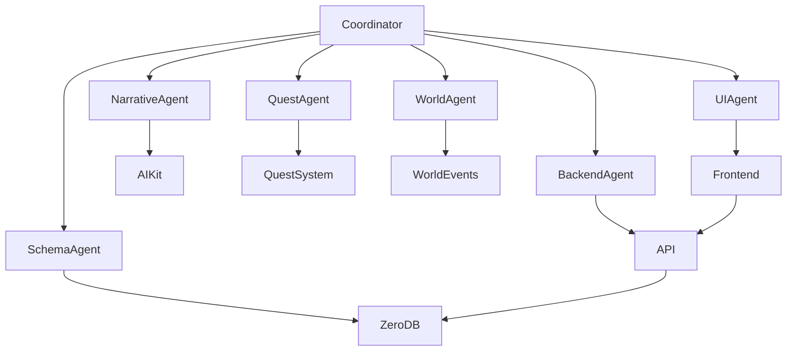

---

# AI Game Master (Moonvale)

# 2-Hour Agent Swarm Sprint Plan

Total Duration: **120 minutes**

Agents: **6 core agents**

Output:

* working AI GM demo
* persistent world
* NPC memory
* quest generation
* world event trigger

---

# Swarm Architecture

Agents operate in parallel.



---

# Agent Roles

### 1️⃣ Coordinator Agent

Orchestrates build tasks.

Responsibilities:

* assign tasks
* track completion
* resolve conflicts
* merge outputs

---

### 2️⃣ Schema Agent

Builds ZeroDB schema.

Handles:

* database tables
* migrations
* seed data

---

### 3️⃣ Backend Agent

Builds API layer.

Handles:

* gameplay events
* GM endpoints
* data access layer

---

### 4️⃣ Narrative Agent

Builds AI Game Master prompt engine.

Handles:

* context retrieval
* narrative generation
* AIKit integration

---

### 5️⃣ Quest Agent

Implements dynamic quest system.

Handles:

* quest generation
* quest progress
* objective tracking

---

### 6️⃣ World Simulation Agent

Implements world state and emergent events.

Handles:

* world state
* event triggers
* simulation variables

---

### 7️⃣ UI Agent

Builds demo dashboard.

Handles:

* player input
* narrative display
* quests panel
* world events panel

---

# 2 Hour Timeline

---

# Phase 1 — Bootstrapping

Duration: **0–15 minutes**

Goal:

Set up the repo and environment.

### Tasks

Coordinator Agent

* create project repo
* initialize Next.js
* configure environment
* assign swarm tasks

Schema Agent

* apply ZeroDB schema
* enable vector extension
* seed world data

Backend Agent

* create base API structure

Deliverables

```
/schema
/api
/lib
/components
/app
```

World seeded with:

* Moonvale
* Northern Forest
* Ember Tower
* Elarin
* 3 lore entries

---

# Phase 2 — Core Data Services

Duration: **15–45 minutes**

Goal:

Implement core backend services.

Agents work **in parallel**.

---

## Schema Agent

Tasks

* implement tables
* create indexes
* verify migrations

Tables deployed:

```
players
npcs
npc_memories
lore_entries
world_regions
world_state
game_events
quests
quest_progress
narrative_logs
world_events
```

---

## Backend Agent

Build APIs:

```
POST /player/create
POST /gm/action
GET /gm/history
POST /event/create
GET /world/state
GET /quests
```

---

## Narrative Agent

Build:

```
GM Context Builder
```

Retrieves:

* player data
* NPC memories
* recent events
* lore entries
* world state

---

Deliverable

Working backend with:

* player creation
* event logging
* context retrieval

---

# Phase 3 — AI Game Master Engine

Duration: **45–75 minutes**

Goal:

Create the narrative engine.

---

## Narrative Agent

Build AI GM prompt.

Prompt format:

```
You are the AI Game Master for Moonvale.

Player history:
Recent events:
NPC memories:
World state:
Relevant lore:
```

Generate:

* narrative outcome
* quest hooks
* memory updates

---

## Backend Agent

Implement endpoint:

```
POST /gm/action
```

Flow:

1 retrieve context
2 call AIKit
3 log narrative
4 create events

---

## Schema Agent

Verify:

```
narrative_logs
npc_memories
```

insert correctly.

---

Deliverable

Player input generates AI narration.

---

# Phase 4 — Dynamic Quest System

Duration: **75–95 minutes**

Goal:

AI generates quests.

---

## Quest Agent

Create:

```
generateQuest()
```

Triggers when:

* major event occurs
* new region explored
* combat threshold reached

---

Example quest

```
Track the Alpha Wolf
```

---

## Backend Agent

Create API:

```
GET /quests
POST /quest/progress
```

---

Deliverable

Quests appear after gameplay events.

---

# Phase 5 — World Simulation

Duration: **95–110 minutes**

Goal:

Enable emergent world reactions.

---

## World Simulation Agent

Implement triggers.

Example rule

```
IF wolf_kills >= 3
THEN
world_event = "Wolf Pack Retreat"
```

Update:

```
world_state
world_events
npc_memories
```

---

Deliverable

World reacts to gameplay.

---

# Phase 6 — Demo UI

Duration: **110–120 minutes**

Goal:

Build the Moonvale demo dashboard.

---

## UI Agent

Create sections:

### Player Panel

Create character.

---

### GM Console

Input:

```
What do you want to do?
```

---

### Narrative Output

Displays AI GM response.

---

### Quest Panel

Active quests.

---

### World Events Panel

Example:

```
Wolf Pack Retreat
```

---

### NPC Memory Viewer

Shows:

```
Player asked about Ember Tower
Player defeated wolves near Moonvale
```

---

Deliverable

Full demo UI.

---

# Final Demo Flow

Instructor performs:

1️⃣ Create player
2️⃣ Ask about Ember Tower

AI GM responds with lore.

3️⃣ Fight wolves

3 times.

4️⃣ World event triggers.

```
Wolf Pack Retreat
```

5️⃣ Ask NPC again.

NPC references player history.

---

# Expected Final System

Components built:

```
ZeroDB Schema
AI GM Engine
Quest Generator
World Simulation
NPC Memory System
Next.js UI
```

All built **in 2 hours using agent swarm parallelization**.

---

# Why This Works

Traditional dev flow:

```
Schema → Backend → AI → Quests → UI
```

Sequential = slow.

Agent swarm flow:

```
Schema
Backend
Narrative
Quests
World
UI
```

Parallel = **10× faster build**.

---

# Final Architecture

```
Player Input
      ↓
AI Game Master
      ↓
Context Retrieval
      ↓
ZeroDB
      ↓
Narration + World Updates
      ↓
UI Display
```

---
